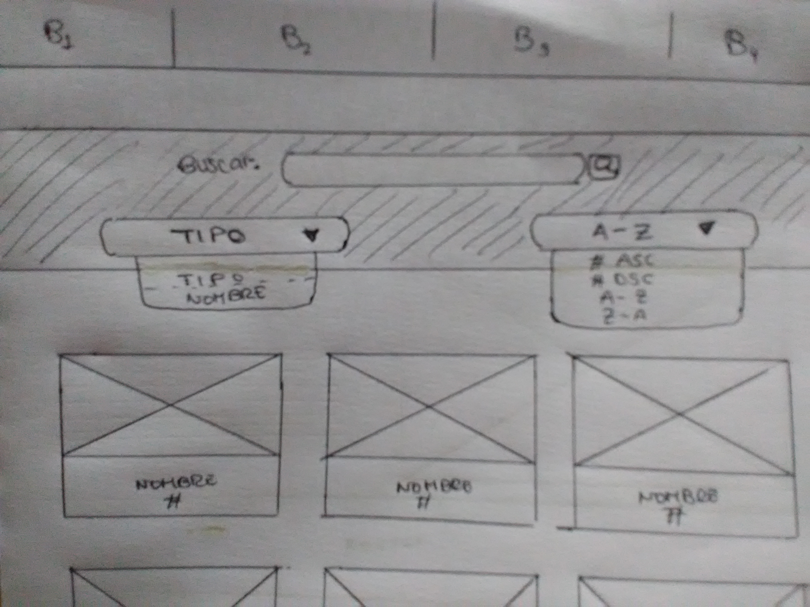
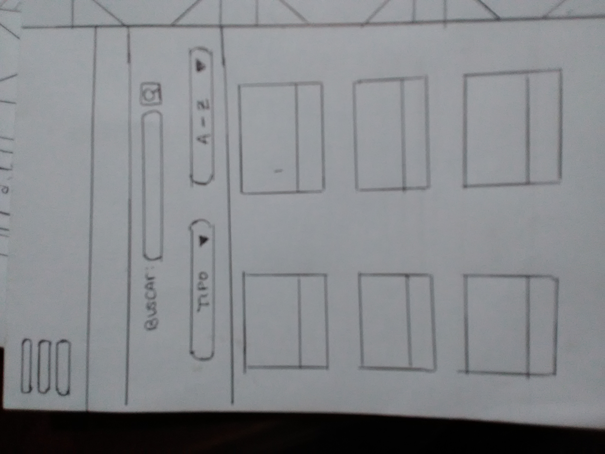
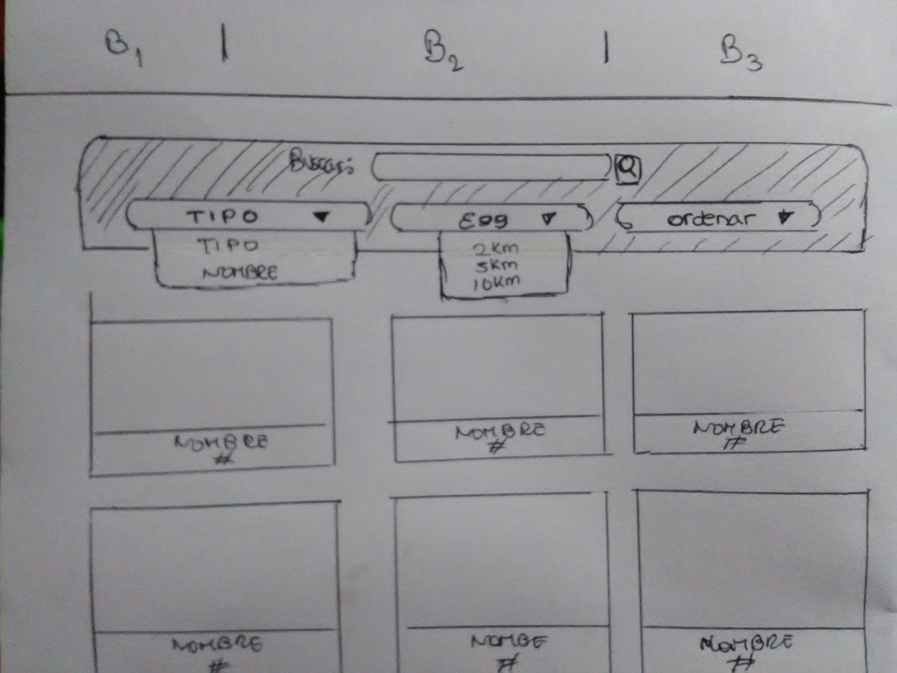
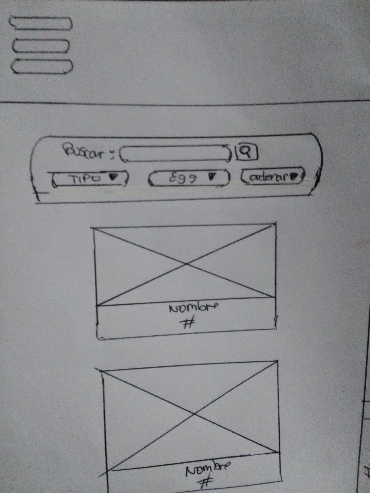
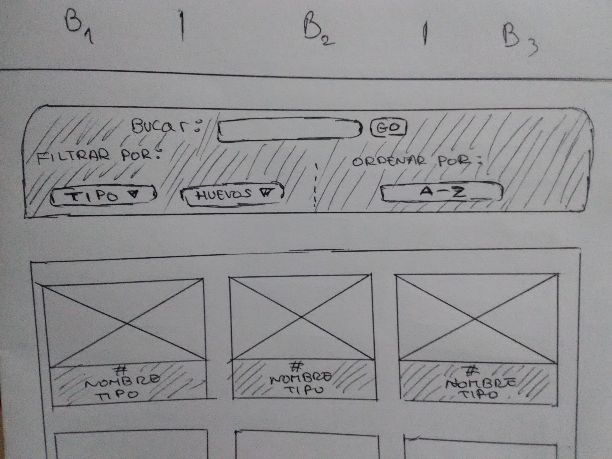
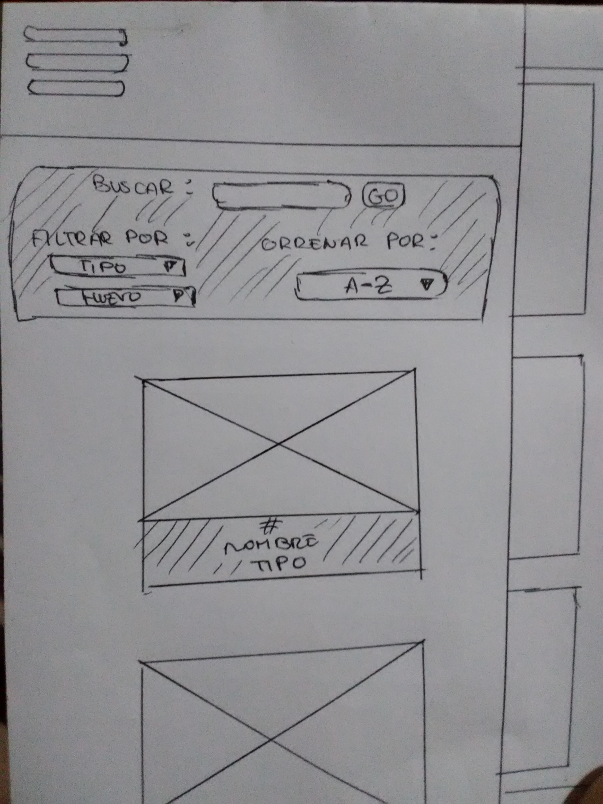
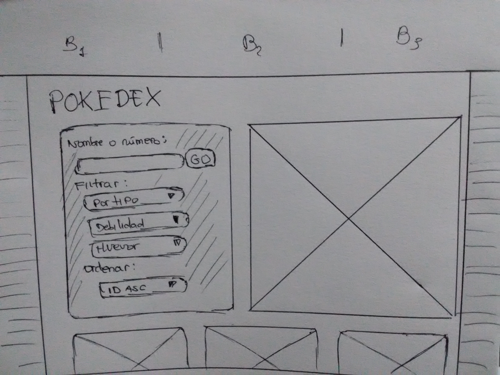
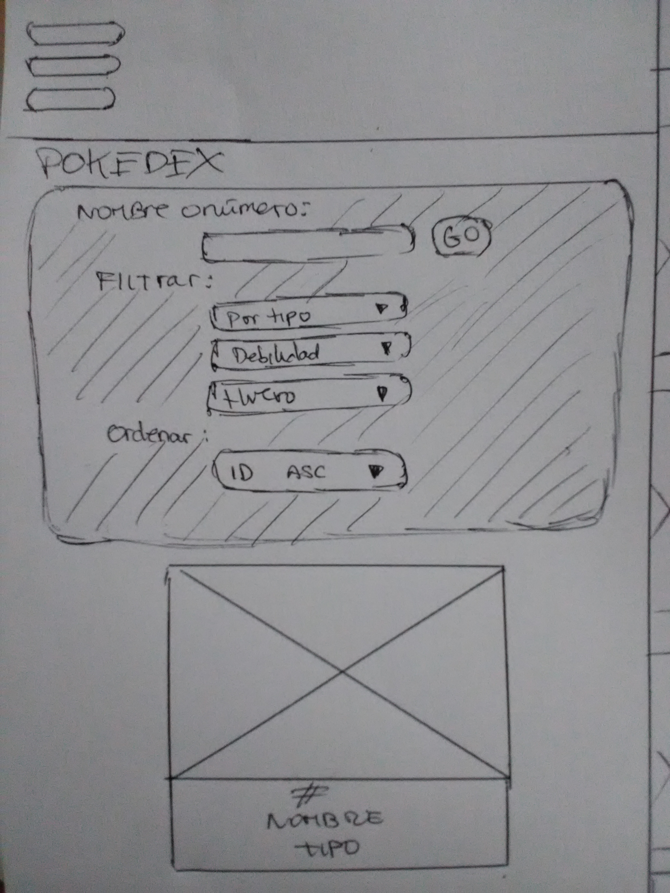

# Pokemon Go
[Link](https://bit.ly/2sscqFp)

## Índice

* [Introducción](#Introducción)
* [Definición del Producto](#Definición-del-Producto)
* [Historias de Usuario](#Historias-de-Usuario)
* [Prototipo de baja fidelidad](#Prototipo-de-baja-fidelidad)
* [Prototipo de alta fidelidad](#Prototipo-de-alta-fidelidad)
* [Testeos de usabilidad](#Testeos-de-usabilidad)

***
## Introducción
**Pokemon Go** es un videojuego de aventura de realidad aumentada, creado por Niantic, Inc. para dispositivos iOS y Android.
El juego consiste en buscar, capturar, y luchar con los personajes de la saga Pokémon, al mismo tiempo que refuerza la actividad física e interacción social, porque obliga a reuniones presenciales de los usuarios. 
## Definición del Producto

* ¿Quiénes son los principales usuarios de producto?

    Hombres y mujeres en sus 20´s, que juegan con frecuencia Pokémon Go.

* ¿Cuáles son los objetivos de estos usuarios en relación con tu producto?

    Buscar Pokémon en específico y conocer datos sobre ellos. 

* ¿Cómo crees que el producto que estás creando está resolviendo sus problemas?
    Nuestro producto facilíta la búsqueda y brinda información adicional de los Pokémon.
## Historias de Usuario

### Historia 1
YO COMO: Usuario de Pokemon Go.

QUIERO: Ver los a todos los Pokemon en la pantalla.
### Historia 2
YO COMO: Usuario de Pokemon Go.

QUIERO: Poder ver información sobre los Pokémon.

### Historia 3
YO COMO: Usuario de Pokemon Go.

QUIERO: Poder filtrar a los Pokemon por:
 * Nombre
 * ID
 * Tipo
### Historia 4
YO COMO: Usuario de Pokemon Go.

QUIERO: Poder filtrar además:
* Por debilidades
*Por huevo.
### Historia 5
YO COMO: Usuario de Pokemon Go.

QUIERO: Que se ordenen de manera ascendente y descendente.
### Historia 6
YO COMO: Usuario de Pokemon Go.

QUIERO: Quiero conocer los Pókemon más fáciles y difíciles de atrapar.
### Historia 7
YO COMO: Usuario de Pokemon Go.

QUIERO: Quiero que me ayuden a calcular mi nuevo CP.

## Prototipo de baja fidelidad

#### PRIMER PROTOTIPO: Versiones => Escritorio y Móvil
 
 
#### SEGUNDO PROTOTIPO: Versiones => Escritorio y Móvil
 
 
#### TERCER PROTOTIPO: Versiones => Escritorio y Móvil
 
 
 #### CUARTO PROTOTIPO: Versiones => Escritorio y Móvil
 
 
## Prototipo de alta fidelidad
#### Versión Escritorio:
[Zeplin](https://zpl.io/a8pJk6J)
#### Versión Móvil:
[Figma](https://bit.ly/2C83Ccr)

## Testeos de usabilidad
#### Primer testeo
Se probó el primer prototipo con 2 usuarios, ambos detectaron los siguientes inconvenientes:
* La opción de buscar relacionada necesariamente con "Tipo" o "Nombre", no les parecía amigable.
* Muy pocas opciones de filtrado, recomendaron filtrado "por hhuevos"
#### Segundo testeo
Se implementó el filtrado por huevos, pero se dejo la opción de "Tipo" o "Nombre" ligados a la búsqueda:
* El usuario insistió en lo poco amigable y además, que fácilmente podrían equivocarse al elegirse la opción y no obtener ningún resultado.
* Aprobaron el filtro por "huevos", pero creyeron que era necesaria tambien la opción de "no en huevos".
* El botón en forma de lupa, no era muy llamativa, se sugirió cambiarla.
* Pidieron que se especifique las opciones de "filtrar" y "ordenar"
* Sugirieron que se mostrara el tipo de cada Pokémon, para verificar que el filtro por Tipo esté haciendo lo correcto.
#### Tercer testeo
Se iplentaron las mejoras requeridas, siendo la opción de "nombre", ya no entre las opciones de filtrado, si no relacionado directamente con la búsqueda.:
* Agrandado del botón de "GO".
* Sugerencia de filtrado por "debilidades"
En vista de que serían muchas opciones se les consultó si les parecería mejor que las colocáramos todas al lado izquierdo de la pantalla y ya no en la superior.:
* Estuvieron de acuerdo.

## ANEXOS:
### Entrevistas (Antes del testeo del producto):
 La entrevista fue realizada a 2 usuarios de Pokémon. 
  1.- ¿Por qué tipos de opciones te parece más importante filtrar a los Pokémon?
  - "...Nombre y tipo como básico."
  - "...tipo, nombre y número"

 2.- ¿Qué información te gustaría ver sobre ellos?
 - "...Sus debilidades, sus evoluciones."
 - "...quiero ver el CP."

 3.- ¿Cómo te gustaría ver dicha información?

 Opción A: En una ventana Modal 
 Opción B: Sobre la propia imagen, al pasar el cursor.
 - Los entrevistados escogieron la opción A.
 